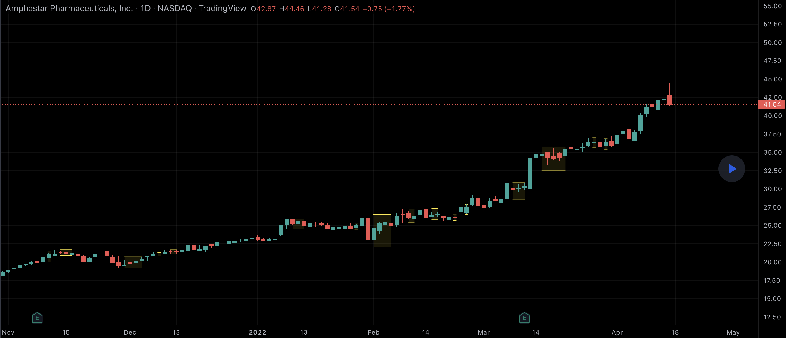

# pine-script

A collection of Pine Scripts that I've written and are using
in my Tradingview setup.

To use them, open up the Tradingview Pine Editor, open a new
indicator and replace the content with the new code; save and
add the indicator to the chart.

## Inside Bars

Indicate bars where their high and low are inside a previous bar.

Inside bars show a period of consolidation in a market.
They often form following a strong move in a market,
as it ‘pauses’ to consolidate before making its next move.

However, they can also form at market turning points and
act as reversal signals from key support or resistance levels."

## Position Sizes

When trading, position sizing and risk calculation is the key to become
 successful.

We need to keep the losses small and adjust the position size according to what
risk we are prepared to take for the planned Entry.

Based on the Account Size and the max percentage we want to risk for any trade,
we calculate, for a number of fixed max Loss percentages:

The Position size, both in percent and in the selected currency.

  * Number of shares to buy.
  * Where to put the Stop Loss.
  * Where a 1RTP (1 Risk amount Take Profit) level could be put .

We also calculate the numbers based on the ATR times a multiple.

The values are presented in a table format and will hopefully aid in selecting
a suitable Stop Loss (based on the chart sutuation) and hence the proper
Position Size.

We also allow for expressing the Account size in currencies other than USD.

Example:

    Account Size in USD and trading US stocks: select USD
    Account Size in SEK but trading US stocks: select USDSEK

[Position Sizes](images/position-sizes.png)
